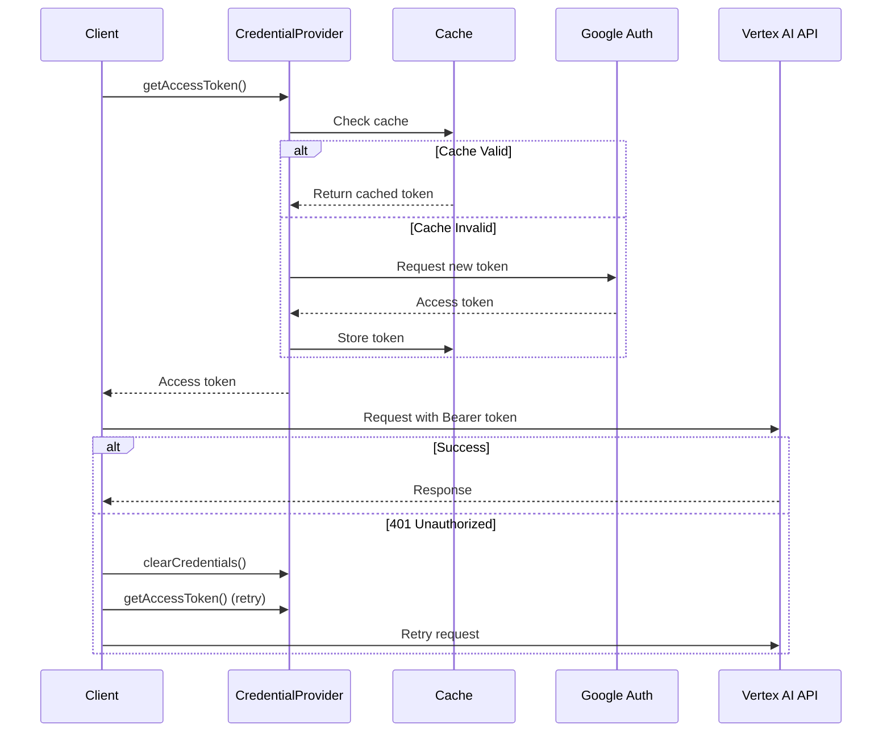

# Authentication Flow Contract

**Feature**: Vertex AI Authentication Improvement  
**Version**: 1.0.0  
**Date**: November 16, 2025

## Overview

This document defines the contracts (interfaces, behaviors, and error handling) for the Vertex AI authentication system. These contracts ensure consistent behavior across all authentication methods.

## 1. Credential Provider Interface

All credential providers must implement this interface to provide access tokens for Vertex AI API requests.

### Interface Definition

```typescript
interface CredentialProvider {
  /**
   * Get the authentication type this provider handles
   */
  getAuthType(): AuthenticationType;

  /**
   * Get a valid access token, refreshing if necessary
   * @returns Access token or throws AuthenticationError
   */
  getAccessToken(): Promise<AccessToken>;

  /**
   * Validate that credentials are properly configured
   * @returns Validation result with error details if invalid
   */
  validate(): Promise<ValidationResult>;

  /**
   * Clear cached credentials and force re-authentication
   */
  clearCredentials(): Promise<void>;

  /**
   * Check if credentials are currently valid (cached)
   */
  isAuthenticated(): boolean;
}
```

### Contract Requirements

1. **Token Freshness**: `getAccessToken()` MUST return a token valid for at least 5 minutes
2. **Idempotency**: Multiple calls to `getAccessToken()` within cache window MUST return same token
3. **Error Handling**: MUST throw `AuthenticationError` with actionable remediation steps
4. **Thread Safety**: MUST handle concurrent calls safely (TypeScript: async/await)
5. **Resource Cleanup**: `clearCredentials()` MUST remove all cached data

### Expected Behaviors

#### Success Path

```typescript
// First call: fetches new token
const token1 = await provider.getAccessToken();
// { token: "ya29.abc...", expiryTime: 1700000000000, tokenType: "Bearer" }

// Second call within cache window: returns cached token
const token2 = await provider.getAccessToken();
// Same token as token1 (no network call)

// Call near expiry: proactively refreshes
await sleep(tokenLifetime - 6 * 60 * 1000); // 6 minutes before expiry
const token3 = await provider.getAccessToken();
// New token (proactively refreshed)
```

#### Error Path

```typescript
// Missing configuration
try {
  const token = await provider.getAccessToken();
} catch (error) {
  // AuthenticationError {
  //   code: 'MISSING_ENV',
  //   message: 'GOOGLE_CLOUD_PROJECT not set',
  //   remediationSteps: ['Set GOOGLE_CLOUD_PROJECT=your-project-id']
  // }
}

// Invalid credentials
try {
  const token = await provider.getAccessToken();
} catch (error) {
  // AuthenticationError {
  //   code: 'INVALID_CREDENTIALS',
  //   message: 'Service account key file is malformed',
  //   remediationSteps: ['Verify JSON file format', 'Download fresh key']
  // }
}
```

## 2. Authentication Detection Contract

The system MUST detect which authentication method to use based on environment.

### Function Signature

```typescript
function detectAuthMethod(): AuthenticationResult {
  // Returns detected method or error
}

interface AuthenticationResult {
  authType: AuthenticationType | null;
  credentialSource: CredentialSource | null;
  error?: AuthenticationError;
}
```

### Detection Priority (Highest to Lowest)

1. **API Key Mode**

   - Condition: `GOOGLE_API_KEY` is set AND (`GOOGLE_GENAI_USE_VERTEXAI === 'true'` OR `GOOGLE_CLOUD_PROJECT` is set)
   - Returns: `{ authType: 'USE_VERTEX_AI', credentialSource: 'API_KEY' }`

2. **Service Account JSON**

   - Condition: `GOOGLE_APPLICATION_CREDENTIALS` points to existing JSON file
   - Returns: `{ authType: 'USE_VERTEX_AI', credentialSource: 'SERVICE_ACCOUNT_FILE' }`

3. **ADC (gcloud)**

   - Condition: `~/.config/gcloud/application_default_credentials.json` exists
   - Returns: `{ authType: 'USE_VERTEX_AI', credentialSource: 'ADC_GCLOUD' }`

4. **Compute Metadata**

   - Condition: Running on GCE/GKE (metadata server responds)
   - Returns: `{ authType: 'COMPUTE_ADC', credentialSource: 'COMPUTE_METADATA' }`

5. **No Credentials**
   - Condition: None of the above
   - Returns: `{ authType: null, credentialSource: null, error: {...} }`

### Contract Invariants

- MUST check methods in priority order (API key before service account before ADC)
- MUST NOT make network calls during detection
- MUST complete detection in <100ms
- MUST handle missing environment variables gracefully

## 3. Validation Contract

Before using credentials, the system MUST validate configuration.

### Validation Function

```typescript
function validateAuthConfiguration(
  authType: AuthenticationType
): ValidationResult;

interface ValidationResult {
  valid: boolean;
  errors: ValidationError[];
  warnings: string[];
}

interface ValidationError {
  field: string;
  message: string;
  remediationSteps: string[];
}
```

### Validation Rules by Auth Type

#### USE_VERTEX_AI with API Key

```typescript
{
  required: [
    { field: 'GOOGLE_API_KEY', pattern: /^[A-Za-z0-9_-]{30,}$/ }
  ],
  optional: [
    { field: 'GOOGLE_CLOUD_PROJECT', pattern: /^[a-z][a-z0-9-]{4,28}[a-z0-9]$/ },
    { field: 'GOOGLE_CLOUD_LOCATION', pattern: /^[a-z]+-[a-z]+\d+$|^global$/ }
  ]
}
```

#### USE_VERTEX_AI with Service Account

```typescript
{
  required: [
    {
      field: "GOOGLE_APPLICATION_CREDENTIALS",
      fileExists: true,
      jsonValid: true,
    },
    {
      field: "GOOGLE_CLOUD_PROJECT",
      pattern: /^[a-z][a-z0-9-]{4,28}[a-z0-9]$/,
    },
    { field: "GOOGLE_CLOUD_LOCATION", pattern: /^[a-z]+-[a-z]+\d+$|^global$/ },
  ];
}
```

#### USE_VERTEX_AI with ADC

```typescript
{
  required: [
    { field: 'GOOGLE_CLOUD_PROJECT', pattern: /^[a-z][a-z0-9-]{4,28}[a-z0-9]$/ },
    { field: 'GOOGLE_CLOUD_LOCATION', pattern: /^[a-z]+-[a-z]+\d+$|^global$/ }
  ],
  checks: [
    { adcFileExists: '~/.config/gcloud/application_default_credentials.json' }
  ]
}
```

### Validation Guarantees

- MUST complete validation before first API call
- MUST provide specific error for each missing/invalid field
- MUST NOT throw exceptions (return ValidationResult)
- MUST validate file existence synchronously
- MUST validate JSON format if applicable

## 4. Token Refresh Contract

Tokens MUST be refreshed before expiration to prevent request failures.

### Refresh Strategy

```typescript
interface TokenRefreshStrategy {
  /**
   * Check if token needs refresh
   */
  needsRefresh(token: AccessToken): boolean;

  /**
   * Perform token refresh
   */
  refresh(): Promise<AccessToken>;

  /**
   * Handle refresh failure
   */
  onRefreshFailure(error: Error): void;
}
```

### Refresh Timing Guarantees

- **Proactive Refresh**: Trigger when `expiryTime - Date.now() < 5 minutes`
- **Grace Period**: Never use token with <30 seconds remaining
- **Retry Logic**: Retry failed refresh once after 1 second delay
- **Fallback**: Clear cache and fetch new token if retry fails

### Refresh Behavior Contract

```typescript
// Token has 10 minutes remaining: Use cached
const token1 = await provider.getAccessToken();
// Returns cached token, no refresh

// Token has 4 minutes remaining: Refresh in background
const token2 = await provider.getAccessToken();
// Triggers refresh, but may return old token if refresh pending

// Token has <30 seconds remaining: Force refresh
const token3 = await provider.getAccessToken();
// Blocks until new token acquired

// Token expired: Fetch new
const token4 = await provider.getAccessToken();
// Clears cache, fetches fresh token
```

## 5. Error Handling Contract

All authentication errors MUST follow this contract.

### Error Structure

```typescript
class AuthenticationError extends Error {
  readonly code: AuthErrorCode;
  readonly message: string;
  readonly remediationSteps: string[];
  readonly originalError?: Error;

  constructor(
    code: AuthErrorCode,
    message: string,
    remediationSteps: string[],
    originalError?: Error
  );
}

enum AuthErrorCode {
  MISSING_ENV = "MISSING_ENV",
  INVALID_CREDENTIALS = "INVALID_CREDENTIALS",
  PERMISSION_DENIED = "PERMISSION_DENIED",
  API_NOT_ENABLED = "API_NOT_ENABLED",
  INVALID_JSON = "INVALID_JSON",
  FILE_NOT_FOUND = "FILE_NOT_FOUND",
  NETWORK_ERROR = "NETWORK_ERROR",
  TOKEN_EXPIRED = "TOKEN_EXPIRED",
  REFRESH_FAILED = "REFRESH_FAILED",
}
```

### Error Code Mappings

Map upstream errors to structured AuthenticationError:

```typescript
// HTTP 401 or 403
{
  code: 'INVALID_CREDENTIALS' or 'PERMISSION_DENIED',
  message: 'Authentication failed: {reason}',
  remediationSteps: [
    'Verify credentials are correct',
    'Check IAM permissions',
    'Ensure service account has "Vertex AI User" role'
  ]
}

// HTTP 404 on API endpoint
{
  code: 'API_NOT_ENABLED',
  message: 'Vertex AI API not enabled for project {projectId}',
  remediationSteps: [
    'Enable Vertex AI API: gcloud services enable aiplatform.googleapis.com',
    'Or visit: https://console.cloud.google.com/apis/library/aiplatform.googleapis.com'
  ]
}

// File not found
{
  code: 'FILE_NOT_FOUND',
  message: 'Service account file not found: {path}',
  remediationSteps: [
    'Verify GOOGLE_APPLICATION_CREDENTIALS path is correct',
    'Ensure file exists and is readable',
    'Use absolute path to avoid relative path issues'
  ]
}

// Network errors
{
  code: 'NETWORK_ERROR',
  message: 'Unable to reach Google Cloud authentication service',
  remediationSteps: [
    'Check internet connectivity',
    'Verify firewall allows HTTPS to *.googleapis.com',
    'Check proxy configuration if applicable'
  ]
}
```

### Error Handling Guarantees

- MUST include at least 2 remediation steps
- MUST preserve original error in `originalError` field
- MUST NOT include sensitive data in error messages
- MUST log full error details at DEBUG level
- MUST show user-friendly message at ERROR level

## 6. API Request Contract

All Vertex AI API requests MUST include proper authentication.

### Request Headers

```typescript
interface VertexAIRequest {
  url: string;
  method: "GET" | "POST" | "PUT" | "DELETE";
  headers: {
    Authorization: `Bearer ${accessToken}`;
    "Content-Type": "application/json";
    [key: string]: string;
  };
  body?: unknown;
}
```

### Request Flow



### Request Guarantees

- MUST include `Authorization: Bearer {token}` header
- MUST retry once on 401 with fresh token
- MUST NOT retry on 403 (permission denied)
- MUST include user agent identifying gemini-cli
- MUST use HTTPS for all requests

## 7. Multi-Model Support Contract

Authentication MUST work consistently across all Vertex AI models.

### Model Endpoint Patterns

```typescript
interface ModelEndpoint {
  model: string;
  endpoint: string;
  region: string;
  authMethod: "bearer_token";
}

const endpointPatterns: Record<string, ModelEndpoint> = {
  "gemini-2.5-pro": {
    model: "gemini-2.5-pro",
    endpoint: "{region}-aiplatform.googleapis.com",
    region: "global",
    authMethod: "bearer_token",
  },
  "claude-sonnet-4-5@20250929": {
    model: "claude-sonnet-4-5@20250929",
    endpoint: "aiplatform.googleapis.com",
    region: "global",
    authMethod: "bearer_token",
  },
  "deepseek-ai/deepseek-v3.1-maas": {
    model: "deepseek-ai/deepseek-v3.1-maas",
    endpoint: "us-south1-aiplatform.googleapis.com",
    region: "us-south1",
    authMethod: "bearer_token",
  },
  "qwen/qwen3-coder-480b-a35b-instruct-maas": {
    model: "qwen/qwen3-coder-480b-a35b-instruct-maas",
    endpoint: "us-south1-aiplatform.googleapis.com",
    region: "us-south1",
    authMethod: "bearer_token",
  },
};
```

### Unified Authentication Contract

ALL models MUST:

- Accept `Authorization: Bearer {token}` header
- Use same token from single credential provider
- Work with any supported authentication method (API key, SA, ADC)
- Return consistent error codes for auth failures

## 8. Security Contract

Authentication implementation MUST follow security best practices.

### Security Requirements

1. **Credential Storage**:

   - MUST use OS keychain when available (macOS Keychain, Windows Credential Manager)
   - MUST encrypt credentials when keychain unavailable
   - MUST set file permissions to 0600 for credential files
   - MUST NEVER commit credentials to version control

2. **Credential Transmission**:

   - MUST use HTTPS for all authentication requests
   - MUST include credentials only in Authorization header (not query params)
   - MUST clear credentials from memory on errors
   - MUST NOT log credential values (use `[REDACTED]`)

3. **Token Lifecycle**:

   - MUST store tokens in memory only (never persist to disk)
   - MUST clear tokens on application exit
   - MUST clear tokens on explicit logout
   - MUST invalidate tokens on credential change

4. **Error Security**:
   - MUST NOT include tokens/keys in error messages
   - MUST sanitize file paths in error messages
   - MUST redact sensitive environment variables in logs
   - MUST use DEBUG level for detailed error info

### Security Test Cases

```typescript
// MUST NOT log credentials
test("credentials not logged", () => {
  const logs = captureDebugLogs(() => {
    provider.getAccessToken();
  });
  expect(logs).not.toContain(actualToken);
  expect(logs).toContain("[REDACTED]");
});

// MUST clear on logout
test("credentials cleared on logout", async () => {
  await provider.getAccessToken(); // Acquire token
  expect(provider.isAuthenticated()).toBe(true);

  await provider.clearCredentials();
  expect(provider.isAuthenticated()).toBe(false);
  expect(memoryContains(token)).toBe(false);
});

// MUST use HTTPS
test("uses HTTPS endpoints", () => {
  const requests = captureNetworkRequests(() => {
    provider.getAccessToken();
  });
  requests.forEach((req) => {
    expect(req.protocol).toBe("https:");
  });
});
```

## Summary

These contracts ensure:

- ✅ Consistent authentication across all Vertex AI models
- ✅ Secure credential handling and storage
- ✅ Clear error messages with remediation steps
- ✅ Automatic token refresh without user intervention
- ✅ Support for multiple deployment environments
- ✅ Backward compatibility with existing auth flows

All implementations MUST adhere to these contracts for quality assurance and maintainability.
